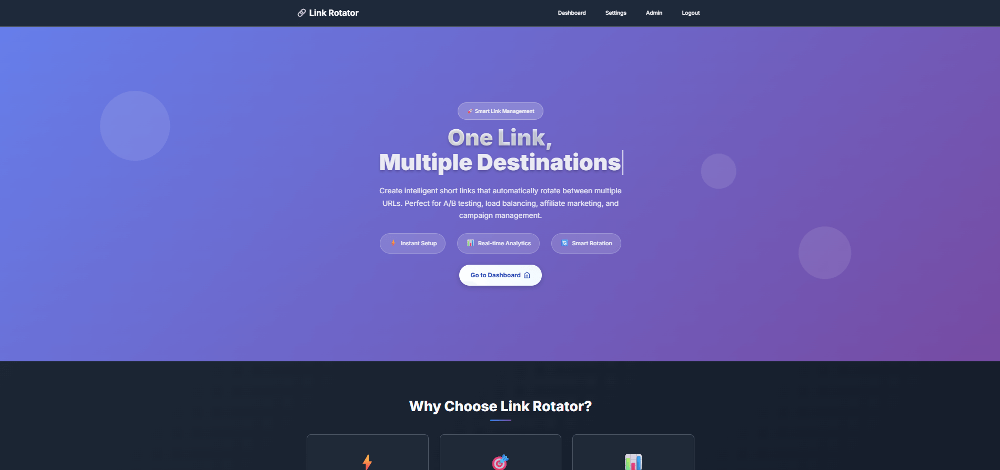

# 🔗 Link Rotator

> **Smart URL Rotation & A/B Testing Tool**

A powerful web application that creates intelligent short links capable of rotating between multiple destination URLs. Perfect for A/B testing, marketing campaigns, load balancing, and affiliate marketing.

## 🌟 Live Demo

**🚀 [Try Link Rotator Live](https://link-rotator.com)**

*Add your screenshot here*

## ✨ Features

### 🎯 Core Functionality
- **Smart Link Rotation** - Create one short link that rotates between multiple destinations
- **Multiple Rotation Types** - Choose between Round Robin (sequential) or Random rotation
- **Custom Short Codes** - Create memorable, branded short links
- **Guest Mode** - Create temporary links without registration (7-day expiration)
- **User Accounts** - Register for permanent links and advanced features

### 📊 Analytics & Tracking
- **Real-time Analytics** - Track clicks, unique visitors, and engagement
- **Daily Statistics** - View performance trends over time
- **Browser Analytics** - See which browsers your audience uses
- **IP Tracking** - Monitor unique visitors and click patterns
- **Recent Activity** - Real-time feed of link interactions

### 🛡️ Security & Performance
- **CSRF Protection** - Secure forms with token validation
- **Rate Limiting** - Prevent abuse with intelligent rate limiting
- **Captcha Verification** - Human verification for link creation
- **Input Validation** - Comprehensive data sanitization
- **SQL Injection Protection** - Prepared statements throughout

### 👤 User Management
- **User Registration/Login** - Secure account system
- **Admin Panel** - Administrative controls and oversight
- **Role-based Access** - User and admin permission levels
- **Profile Management** - Update passwords and account settings

## 🛠️ Tech Stack

### Backend
- **PHP 7.4+** - Server-side language
- **MySQL/MariaDB** - Database storage
- **PDO** - Database abstraction layer

### Frontend
- **HTML5** - Modern markup
- **CSS3** - Custom styling with animations
- **JavaScript (Vanilla)** - Interactive functionality
- **Google Fonts** - Typography (Inter & JetBrains Mono)

### Development
- **XAMPP Compatible** - Easy local development setup
- **Session Management** - Secure user sessions
- **RESTful APIs** - Clean API endpoints

## 🎨 Key Use Cases

- **A/B Testing** - Test different landing pages or offers
- **Load Balancing** - Distribute traffic across multiple servers
- **Affiliate Marketing** - Rotate between different affiliate programs
- **Campaign Management** - Manage multiple marketing campaigns
- **Content Testing** - Test different content variations
- **Geographic Routing** - Route users to region-specific content

## 🚀 Getting Started

Visit **[https://link-rotator.com](https://link-rotator.com)** to start using the platform immediately!

### How to Use:
1. **Create Links** - Add multiple destination URLs to create a rotator
2. **Choose Rotation Type** - Select Round Robin or Random rotation
3. **Track Performance** - Monitor clicks and analytics in real-time
4. **Manage Links** - Edit, delete, or create new rotators anytime

## 💬 Feedback

Have suggestions or found a bug? Feel free to create an issue or reach out!

## 📄 License

This project is open source and available under the [MIT License](LICENSE).

## 🔗 Links

- **Live Demo:** [https://link-rotator.com](https://link-rotator.com)
- **Support:** [Telegram Channel](https://t.me/sanjivvip)

---

*Built with ❤️ for smarter link management* e
